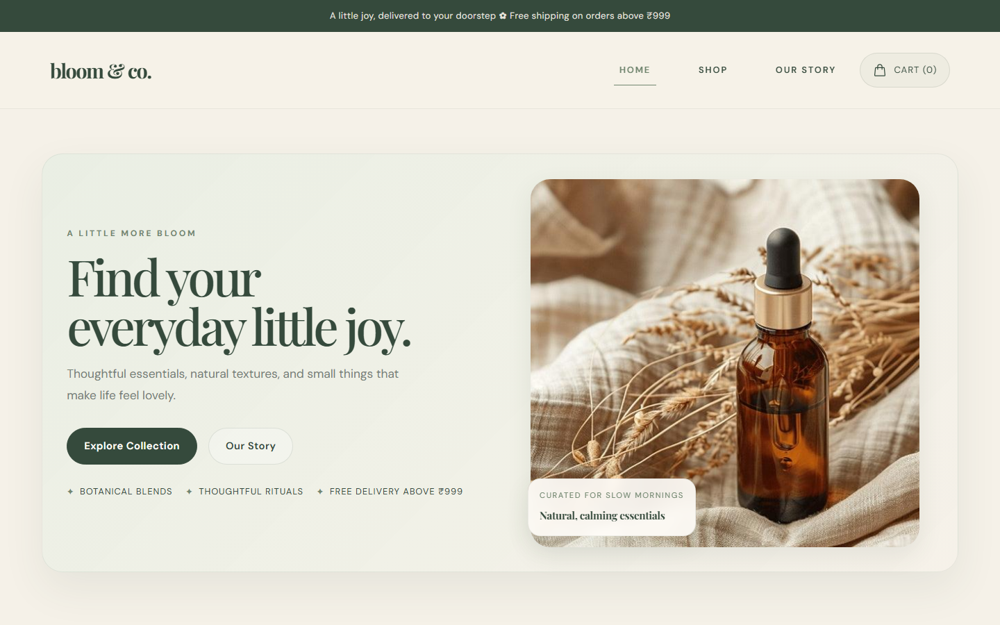
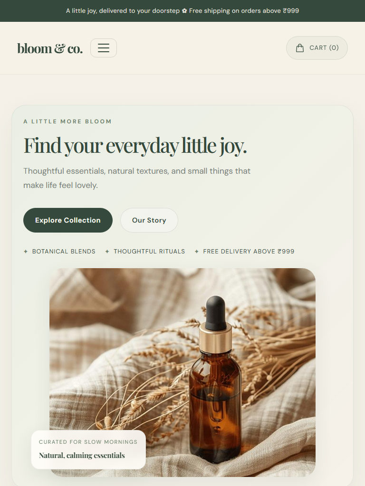
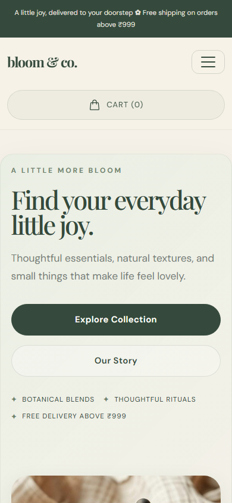
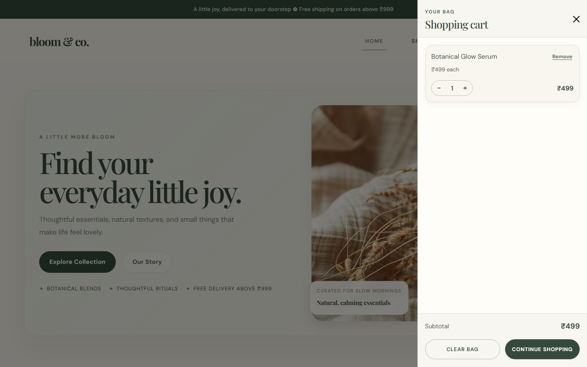
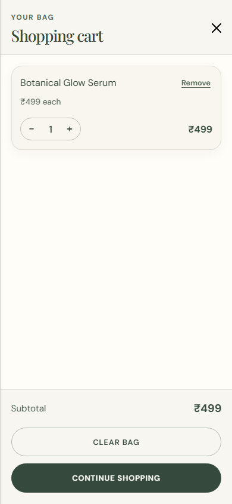

# Bloom & Co.

> Little things that make your everyday bloom.

Bloom & Co. is a responsive, single-page storefront concept for thoughtfully selected botanical and everyday lifestyle products. It brings together an editorial brand presentation, a small product collection, an interactive client-side shopping cart, and a newsletter signup experience.

**Live demo:** [bloomandcoweb.netlify.app](https://bloomandcoweb.netlify.app/)

## Design concept

The visual identity takes cues from boutique botanical and lifestyle brands. A warm ivory and cream foundation is balanced with forest-green and sage accents, with blush details used sparingly. Playfair Display gives headings an editorial character, while DM Sans keeps navigation and body copy clear. Product photography, soft shadows, and restrained rounded shapes support a calm, product-focused shopping experience across screen sizes.

## Features

- Responsive single-page layout with a collapsible Bootstrap navigation menu, hero section, product collection, newsletter area, and footer.
- Three product cards with product images, labels, Indian rupee prices, and add-to-cart feedback.
- Bootstrap offcanvas shopping cart with a live item count, quantity controls, item removal, clear-cart action, calculated subtotal, and an empty-cart state.
- Client-side email format validation with success and error feedback in the newsletter form.
- Responsive layouts for mobile and desktop, including a full-width mobile cart trigger and stacked cart actions.

Cart contents exist only in browser memory and reset when the page reloads. The newsletter form displays local feedback but does not submit or store an email address.

## Technology stack

- HTML5
- CSS3
- Bootstrap 5.3.8 (CDN)
- Vanilla JavaScript
- Google Fonts: Playfair Display and DM Sans
- Netlify hosting

## Project structure

```text
.
├── index.html
├── css/
│   └── style.css
├── js/
│   └── script.js
├── Assets/
│   ├── botanicalserum.jpg
│   ├── candle.jpg
│   ├── img1.jpg
│   └── mug.jpg
├── Screenshots/
│   ├── Screenshot 2026-10-04 153754.png
│   ├── Screenshot 2026-10-04 154119.png
│   ├── Screenshot 2026-10-04 154237.png
│   └── Responsive/
│       ├── desktop.png
│       ├── tablet.png
│       ├── mobile.png
│       ├── desktop-cart.png
│       └── mobile-cart.png
├── .gitignore
└── README.md
```

## Run locally

No build step or package installation is required.

1. Clone the repository and enter the project directory:

	```bash
	git clone https://github.com/iqra9658/bloom-and-co.git
	cd bloom-and-co
	```

2. Open `index.html` directly in a browser, or serve the folder with a local development server such as the VS Code Live Server extension.

Bootstrap and Google Fonts are loaded from CDNs, so an internet connection is required for those external resources. Product images and site code are stored locally in this repository.

## Screenshots

### Homepage


### Product collection


### Newsletter and footer


## Responsive Design & Preview

The storefront adapts its navigation, product layout, and cart drawer for desktop, tablet, and mobile viewports. These captures show the rendered site at the target viewport sizes.

### Desktop Preview



*Desktop homepage at 1440 × 900, showing the full hero layout and primary navigation.*

### Tablet Preview



*Tablet homepage at 768 × 1024, with the responsive navigation and stacked hero content.*

### Mobile Preview



*Mobile homepage at 390 × 844, showing the compact navigation and single-column hero.*

### Shopping Cart Preview



*Desktop cart drawer with a sample product, quantity controls, and subtotal.*



*Mobile cart drawer with the same sample product and vertically arranged actions.*

## Current limitations

- This is a frontend demonstration. Product data and prices are defined in the page markup; there is no product API, inventory management, or database.
- The cart does not create or submit orders, persist across reloads, or connect to a checkout service.
- No payment provider or real payment processing is integrated.
- Newsletter validation and confirmation happen only in the browser; no mailing list service receives submissions.
- Navigation and footer destinations that are not implemented use placeholder `#` links.

## Potential enhancements

- Connect product listings, inventory, and order submission to a backend service.
- Add a secure checkout flow through a supported payment provider.
- Persist cart contents between visits and synchronize them with an account when authentication is added.
- Connect the newsletter form to an email marketing platform, with appropriate consent and unsubscribe handling.
- Add product detail pages, collection filtering, and automated end-to-end tests.
